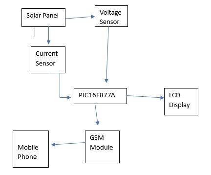
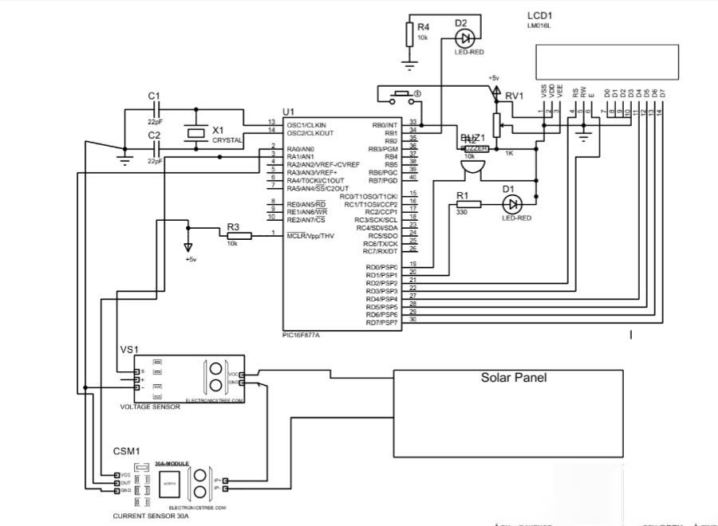

# Solar Energy Measurement System using PIC16F877A

A **solar energy measurement system** that monitors voltage, current, and power of solar panels in real‑time. Data is displayed on a 16×2 LCD, and SMS alerts are sent via a GSM module when the voltage drops below 3.7V. Designed around a **PIC16F877A** microcontroller.

---

## Table of Contents

- [Features](#features)
- [Components Required](#components-required)
- [Circuit Diagrams](#circuit-diagrams)
- [Pin Connections](#pin-connections)
- [Code](#code)
- [Working Principle](#working-principle)
- [How to Use](#how-to-use)
- [Results](#results)
- [Advantages](#advantages)
- [Future Improvements](#future-improvements)
- [Full Report](#full-report)
- [Author](#author)
- [License](#license)

---

##  Features

- Real‑time voltage and current measurement  
- Solar power calculation (P = V × I)  
- 16×2 LCD display for local monitoring  
- Low‑voltage alert via GSM module (SMS to mobile)  
- EEPROM storage for maximum recorded voltage  
- Buzzer and LED indicators for system status  
- Low‑power operation with efficient firmware

---

## Components Required

| Component | Quantity |
|-----------|----------|
| PIC16F877A Microcontroller | 1 |
| 20 MHz Crystal Oscillator | 1 |
| Solar Panel (DC source) | 1 |
| ACS712 5A/20A Current Sensor | 1 |
| Resistors (18kΩ, 2kΩ, 30kΩ, 7.5kΩ) | As needed |
| 16×2 LCD Display | 1 |
| GSM Module (SIM900A) | 1 |
| Buzzer | 1 |
| LED | 1 |
| 5V Voltage Regulator (7805) | 1 |
| Capacitors (22pF, 100nF, 470µF) | As needed |
| Breadboard & Jumper Wires | As needed |

---

## Circuit Diagrams

| Block Diagram | Circuit Diagram |
|---------------|-----------------|
|  |  |

> *Click on the images to zoom. Detailed connections are shown in the circuit diagram.*

---

## Pin Connections (PIC16F877A)

| Component | PIC16F877A Pin | Description |
|-----------|----------------|-------------|
| Voltage Divider Output | AN1 (RA1) | Solar panel voltage |
| ACS712 Output | AN0 (RA0) | Solar panel current |
| LCD RS | RD2 | Register Select |
| LCD EN | RD3 | Enable |
| LCD D4 – D7 | RD4 – RD7 | Data bus |
| Buzzer | RD1 | Alert indicator |
| LED | RD0 | Status indicator |
| GSM TX | RC6 (TX) | UART transmit |
| GSM RX | RC7 (RX) | UART receive |
| Crystal OSC1/2 | RA7, RA6 | 20 MHz |

---

##  Code

📄 **Full C code for PIC16F877A:** [`code/solar_measurement.c`](code/solar_measurement.c)

### Key Functions

| Function | Description |
|----------|-------------|
| `ADC_Init()` / `ADC_Read()` | Analog‑to‑Digital Conversion |
| `EEPROM_Write()` / `EEPROM_Read()` | Store/retrieve max voltage from internal EEPROM |
| `GSM_Init()` / `GSM_SendSMS()` | Initialize GSM module and send SMS alerts |
| `FloatToStr()` / `Display_float()` | Convert and display float values on LCD |
| `Lcd_*()` | 4‑bit LCD control functions |

> **Compiler:** XC8 (v2.00+)  
> **IDE:** MPLAB X  
> **Oscillator:** 20 MHz, HS mode

---

##  Working Principle

1. **Voltage Measurement**  
   A voltage divider (18kΩ + 2kΩ) steps down the solar panel voltage to the 0‑5V range.  
   `Vin = Vout × (R1+R2)/R2`

2. **Current Measurement**  
   The ACS712 Hall‑effect sensor outputs an analog voltage proportional to current (185 mV/A for the 5A version).  
   `I = (Vout − Vmid) / sensitivity` where Vmid = 2.5V

3. **Power Calculation**  
   `Power (W) = Voltage (V) × Current (A)`

4. **LCD Display**  
   The system cycles through Voltage, Current, Power, and Maximum Voltage every few seconds.

5. **Low‑Voltage Alert**  
   If `Vin < 3.7V`:  
   - Buzzer sounds for 1 second  
   - GSM module sends an SMS to a predefined number (only once until voltage recovers above 4.7V)  

6. **EEPROM**  
   The highest measured voltage is stored in the PIC’s internal EEPROM and persists after power‑off.

---

##  How to Use

1. **Wire the circuit** as shown in the [Circuit Diagram](#circuit-diagrams).  
2. **Compile the code** using MPLAB X with the XC8 compiler.  
3. **Flash the firmware** to the PIC16F877A using a programmer (e.g., PICkit 3/4).  
4. **Power the system** with a regulated 5V DC supply.  
5. **Connect the solar panel** – voltage divider input to panel output, load through ACS712.  
6. **Monitor the LCD** – it will display voltage, current, and power.  
7. **SMS setup** – change the phone number in `GSM_SendSMS()` before compiling (inside the code).  

---

##  Results

| Parameter | Range | Accuracy |
|-----------|-------|----------|
| Voltage | 0 – 25V (with divider) | ±5% |
| Current | 0 – 5A (ACS712‑5A) | ±1.5% |
| Power | Calculated | Depends on V & I |

System successfully measures solar panel parameters.  
SMS alert sent when voltage drops below 3.7V.  
Maximum voltage retained in EEPROM after power cycles.

---

## Advantages

- **Low Cost** – uses affordable, common components  
- **Real‑time Monitoring** – immediate local reading on LCD  
- **Remote Alert** – GSM notifies the user even from afar  
- **Persistent Storage** – EEPROM saves highest voltage  
- **Expandable** – easy to add IoT, data logging, or MPPT

---

## Future Improvements

-  **IoT Integration** – send data to cloud platforms (Blynk, ThingSpeak)  
-  **Data Logging** – add an SD card module for historical records  
-  **Battery Charging Control** – integrate a charge controller  
-  **Web Dashboard** – real‑time remote monitoring  
-  **MPPT Algorithm** – implement Maximum Power Point Tracking  
-  **Mobile App** – dedicated app for alerts and trends

---

##  Full Report

📎 **Detailed project documentation:** [`doc/SOLAR_ENERGY_MEASUREMENT_SYSTEM.pdf`](doc/SOLAR_ENERGY_MEASUREMENT_SYSTEM.pdf)  
Includes abstract, literature survey, methodology, results, and references.

---

##  Author

**P.G.R.Hasith Pusswella** 

Faculty of Engineering  
SLTC Research University  
August 2024

---

##  License

This project is licensed under the **MIT License** – see the [LICENSE](LICENSE) file for details.

---

## Acknowledgements

- Microchip Technology – PIC16F877A datasheet and MPLAB X IDE  
- Allegro MicroSystems – ACS712 current sensor  
- SIMCom – SIM900A GSM module reference

---

 *If this project helps you, please give it a star on GitHub!*
